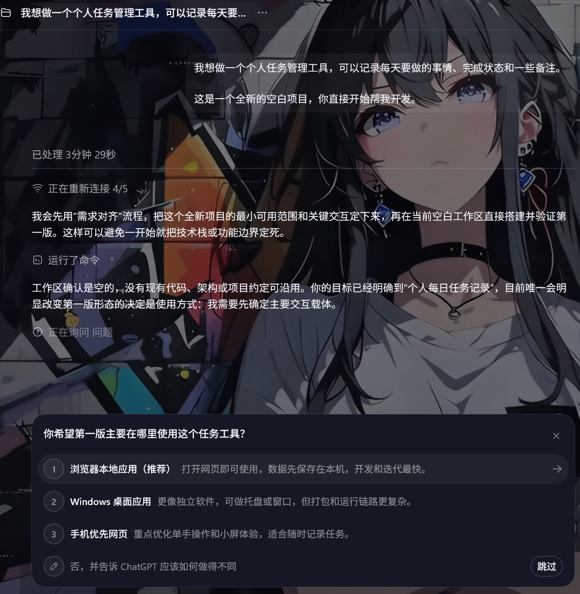
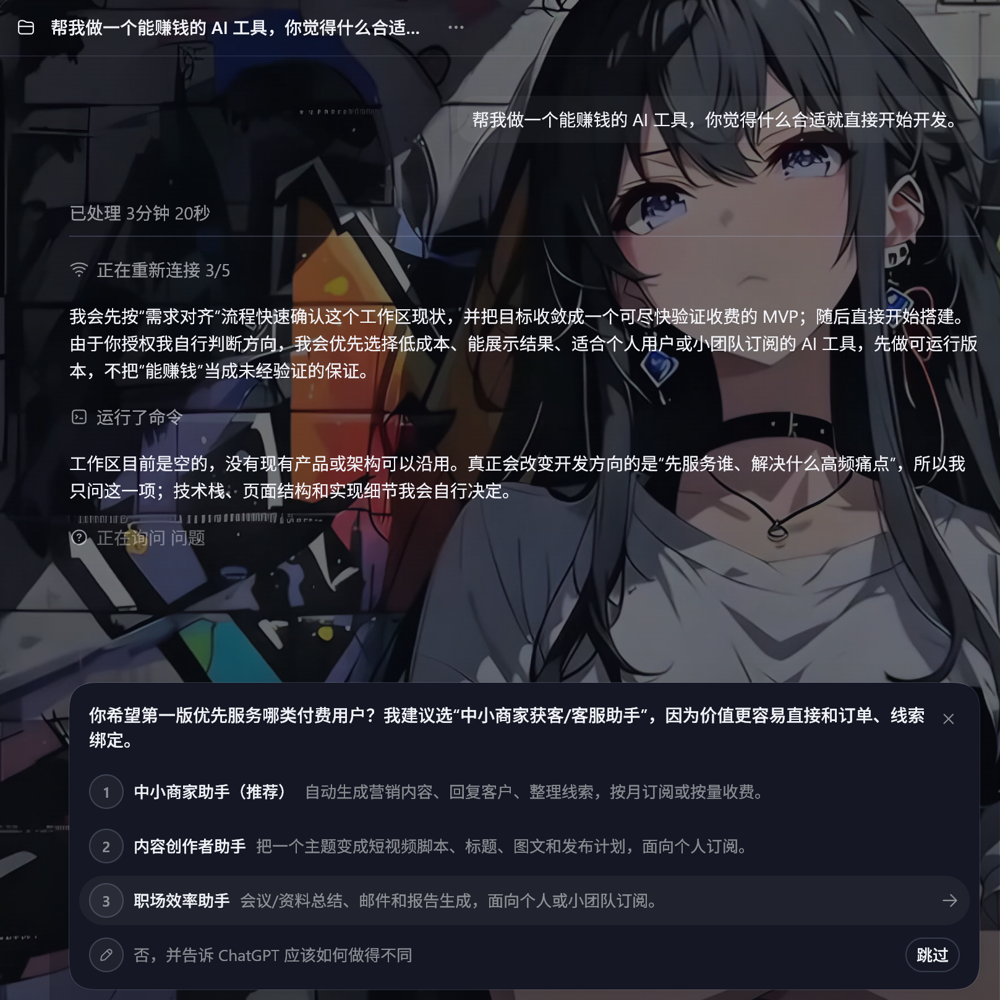
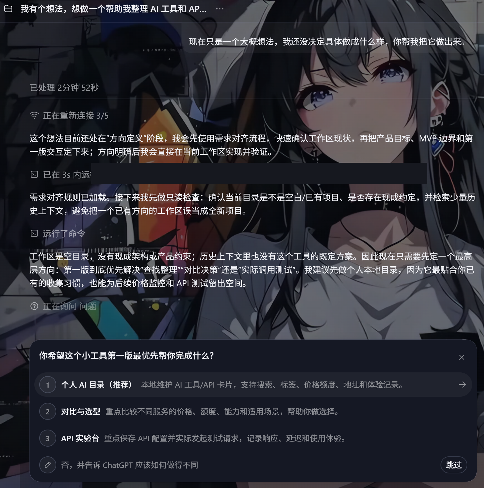
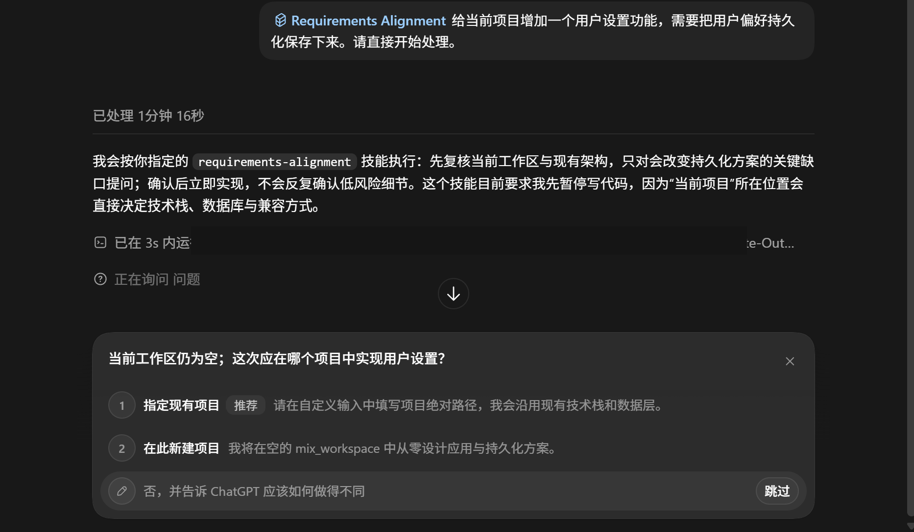
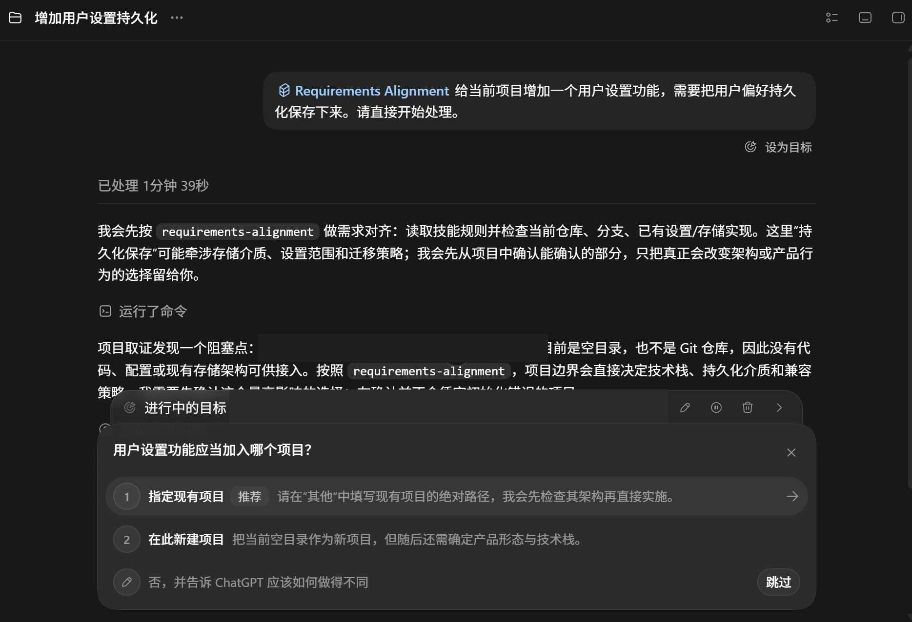

**English** | [简体中文](README.zh-CN.md)

# Requirements Alignment for Codex

> Align before coding. Re-align when direction changes. Then get out of the way.

Stop Codex from silently deciding what your product should be.

Requirements Alignment is a lightweight direction-alignment guardrail for Codex Desktop. It asks about the decisions that define what you are building, then steps aside and lets Codex code.

**You decide the direction. Codex decides the engineering details.**

- **Auto or on-demand** — let it activate around unclear direction, or invoke `$requirements-alignment` yourself.
- **Native structured questions when available** — uses Codex `request_user_input` when the current Desktop build supports it.
- **No full planning workflow required** — align only the few decisions that materially change the result.
- **Re-align on new high-impact decisions** — the guardrail can return after kickoff without continuously interrupting work.
- **Safe install / uninstall / restore** — switch modes, uninstall, or restore installer-created backups.
- **Windows Codex Desktop** — no Codex CLI or third-party dependency required.

## Real Codex Desktop test



*Real Codex Desktop Auto Mode test. The prompt did not explicitly invoke `$requirements-alignment`; the Skill activated before Codex chose Web, Windows, or mobile on the user's behalf.*

## Why?

### Before

User:

> Build me a personal task manager.

Codex may silently assume Web, `localStorage`, no account, no sync, and an arbitrary UI, then start implementing.

### After

Requirements Alignment first asks a direction-defining question:

```text
Where should the first version primarily be used?

○ Local browser app (Recommended)
○ Windows desktop app
○ Mobile-first web app
○ Other
```

Once the direction is clear, Codex resumes and owns the engineering work.

Requirements Alignment focuses on **“What are we actually building?”**, not **“Should this loop use `map` or `for`?”**

## What it adds

### 1. Align before coding

A vague idea is enough to start. Codex identifies the few product decisions that need a human answer before substantive implementation.

### 2. A lightweight direction guardrail

It helps reduce wasted implementation caused by silent assumptions about target users, product form, scope, interaction, data, identity, sync, compatibility, or architecture.

### 3. Direction, not implementation trivia

The user owns high-impact direction. Codex remains autonomous over filenames, helper placement, variables, routine code structure, ordinary library use, and other low-impact implementation details.

### 4. Auto or on-demand

Use Auto for implicit activation around unclear direction. Use on-demand invocation when you want to call the guardrail yourself. Think Auto is too proactive? Switch to Manual at any time.

## Auto / Manual

### Auto Mode (recommended)

Use Codex normally. You do not need to type `$requirements-alignment`.

Requirements Alignment can activate when Codex finds:

- a new or blank project;
- a vague product idea;
- unresolved product direction;
- a high-impact choice about scope, interaction, data, identity, sync, compatibility, or architecture.

Once the first implementation direction is coherent, it stops asking and lets Codex continue. Clear bug fixes, formatting, version text edits, and repository-established decisions should proceed without an interview.

### Manual Mode

Manual Mode disables implicit invocation. Codex works normally until you explicitly invoke:

```text
$requirements-alignment
```

Auto and Manual use the same alignment policy. The difference is who decides when to start it: Codex or you.

## See it in action

All five images below are real Requirements Alignment v0.1.0 tests in Codex Desktop. The first three demonstrate Auto Mode without an explicit `$requirements-alignment` invocation.

### 1. Align the target user

Prompt: *“Build me an AI tool that can make money. Pick whatever makes sense and start developing.”*

Instead of choosing a product on the user's behalf, Requirements Alignment asks which paying user the first version should serve.



### 2. Align the product form

Prompt: *“Build me a personal task manager. This is a brand-new blank project; start developing it.”*

The user chooses browser, Windows, or mobile before Codex commits to the product form.


### 3. Align the MVP direction

Prompt: *“I have a rough idea for a small tool that organizes AI tools and APIs. I have not decided what form it should take; build it for me.”*

Requirements Alignment asks what the first version should primarily accomplish before architecture and implementation follow.



*Privacy note: one local absolute path in this real screenshot was masked. The prompt, behavior, native question, and options were not changed.*

### 4. Re-align when direction changes

#### Manual alignment when you want it

Need alignment only occasionally?

Invoke `$requirements-alignment` manually when a task reaches a decision you want to keep under human control. Codex can pause before making the affected product decision, ask for your direction, and continue once the decision is clear.

This demonstrates explicit, on-demand invocation. It does **not** claim that the Manual profile was necessarily installed when the screenshot was taken.



*Privacy note: the local Skill path was masked. The prompt, output meaning, native question, and options were not changed.*

#### Re-align during an active Goal

Alignment does not stop after kickoff.

If a new direction-defining decision appears while a Goal is already running, Requirements Alignment can pause before Codex silently commits to that direction. The user makes the high-impact decision, then Codex can continue. Routine engineering details remain autonomous.



*Privacy note: two local absolute paths were masked. The active Goal state, prompt, behavior, native question, and options were not changed.*

The intended lifecycle is lightweight:

```text
Vague idea → Align direction → Implement → New high-impact decision → Re-align → Continue
```

## Codex already has `request_user_input`. What does this add?

Codex and `request_user_input` provide the structured-question capability and native UI.

Requirements Alignment provides the decision policy around that capability:

- when a greenfield idea needs alignment before implementation;
- which decisions belong to the user;
- which engineering decisions Codex should make autonomously;
- when a new direction-defining decision warrants re-alignment during implementation;
- when alignment is no longer necessary;
- when Codex should stop asking and resume coding.

**Codex provides the question UI. Requirements Alignment decides when the question is worth asking.**

This project does not claim to have created `request_user_input`, to have invented a new Codex UI, or to make Codex capable of asking questions for the first time. Its contribution is a lightweight direction-alignment policy built on top of the capabilities Codex already provides.

## Direction guardrail

v0.1.0 uses a lightweight **Direction Alignment** policy.

### Greenfield Alignment Gate

Before implementation begins, the gate checks the highest-priority unresolved decisions—starting with **Product goal / user goal**, then scope and user-facing behavior. It asks only what can change the product direction, not a fixed questionnaire.

Requirements Alignment covers two moments.

### 1. Before implementation

When product direction is unresolved, it avoids treating reversible engineering defaults—Web, local storage, no account, no sync, or an arbitrary MVP—as permission to decide the product for the user.

### 2. During implementation

When a new product, scope, behavior, data, identity, sync, compatibility, architecture, or destructive decision appears, it can re-align before that choice is silently embedded in the implementation.

This is **re-align when new high-impact decisions appear**, not continuous monitoring. It stays out of the way until direction needs a human decision.

## Not another planning framework

Requirements Alignment intentionally does less. It is not a full requirements-management system, PRD tool, spec-driven development process, architecture workflow, planning framework, or deep multi-round interview system.

It solves one narrow problem:

> Ask the few high-value questions that determine what is being built. Then get out of the way.

## How is this different?

These projects solve overlapping but different problems:

- [Superpowers Brainstorming](https://github.com/obra/superpowers/blob/main/skills/brainstorming/SKILL.md) turns ideas into approved designs/specs through structured dialogue, approach comparison, design validation, and a planning handoff. Requirements Alignment does not require a complete design or formal spec before continuing.
- [Oh My Codex Deep Interview](https://github.com/Yeachan-Heo/oh-my-codex/blob/main/skills/deep-interview/SKILL.md) is an intent-first Socratic requirements interview with configurable depth, ambiguity scoring, pressure-testing, and execution-ready artifacts. Requirements Alignment aims only for enough clarity to start the right first version.
- [GitHub Spec Kit](https://github.com/github/spec-kit) provides a Spec-Driven Development workflow with artifacts across Spec → Plan → Tasks → Implement. Requirements Alignment adds a decision layer to an existing Codex workflow rather than replacing it.
- [BMAD Method](https://github.com/bmad-code-org/BMAD-METHOD) is a broader AI-driven development methodology spanning analysis, planning, architecture, implementation, and specialized agents. Requirements Alignment has a deliberately smaller scope.

Requirements Alignment can complement these workflows; it does not require users to abandon them.

## Comparison

| Project | Primary goal | Interaction depth | Full spec / plan workflow | Lightweight alignment | Codex Desktop / no CLI focus |
|---|---|---|---|---|---|
| **Requirements Alignment** | Direction alignment | Lightweight; a few high-value questions | No | Yes; Auto or on-demand | Yes |
| Superpowers Brainstorming | Approved design/spec before implementation | Structured dialogue, alternatives, design approval | Design/spec plus planning handoff | Not the primary focus | Not the primary focus |
| Oh My Codex Deep Interview | Socratic clarification into an execution-ready spec | Configurable quick / standard / deep; potentially multi-round | Requirements artifact plus execution/planning handoff | Quick mode exists; deeper interviewing is the primary focus | No; primarily a Codex CLI workflow layer |
| GitHub Spec Kit | Spec-Driven Development | Multi-stage artifact workflow | Spec → Plan → Tasks → Implement | Not the primary focus | Agent-agnostic, not Desktop-specific |
| BMAD Method | Full AI-driven development methodology | Scale-adaptive, multi-agent workflow | Complete lifecycle | Not the primary focus | Multi-tool, not Desktop-specific |

The table summarizes each project's official positioning; it is not a quality ranking.

## Which one should I use?

Use Requirements Alignment if:

- you already like your Codex workflow;
- you do not want another full planning framework;
- you mainly want Codex to stop guessing important product decisions;
- you want alignment to end as soon as the first-version direction is clear;
- you want optional Auto or explicit on-demand invocation;
- you primarily use Codex Desktop on Windows.

Consider a full planning/spec framework if:

- you need formal requirements documents;
- you want detailed architecture or design artifacts;
- you want a structured multi-stage development lifecycle;
- you want extensive requirements interviewing;
- you need durable planning artifacts across the project.

Requirements Alignment is complementary. Choose the amount of process your work actually needs.

## Quick Start

Download the repository or `requirements-alignment-v0.1.0.zip` from the [v0.1.0 Release](https://github.com/jiezeng2004-design/requirements-alignment/releases/tag/v0.1.0), extract it, and run in Windows PowerShell:

```powershell
powershell.exe -NoProfile -ExecutionPolicy Bypass -File ".\scripts\install.ps1"
```

No Codex CLI or third-party dependency is required. On first install, choose:

```text
1. Auto (recommended)
2. Manual
```

The Skill is installed at:

```text
$HOME\.agents\skills\requirements-alignment
```

Restart Codex Desktop and start a new task so Skills and global instructions are reloaded.

## Native `request_user_input`

Native structured input depends on the current Codex Desktop build and may still be experimental or under development. This project does not present it as a guaranteed stable capability.

If the target feature is not enabled, the installer explains its experimental status before offering an incremental update:

```toml
[features]
default_mode_request_user_input = true
```

The installer manages only that target key and preserves other features. The native feature and the Auto / Manual Skill mode are independent. When native structured input is unavailable, the Skill can fall back to compact plain-text questions.

## Switch, uninstall, restore

Run the installer again to switch Auto / Manual, reinstall, uninstall, or restore an installer-created backup.

Safety boundaries:

- backs up the installed Skill, `AGENTS.md`, and `config.toml` before changes;
- stores backups under `$HOME\.codex\requirements-alignment-backups\`;
- manages only its explicitly marked AGENTS block;
- does not intentionally overwrite other AGENTS rules or other Skills;
- keeps the native feature on uninstall by default;
- creates a pre-restore backup and verifies installer manifests and SHA-256 hashes;
- does not modify Codex itself, access the network, or install packages.

## Tests

Run the dependency-free isolated test suite:

```powershell
powershell.exe -NoProfile -ExecutionPolicy Bypass -File ".\tests\run-tests.ps1"
```

Tests use temporary user directories and do not modify the real Codex configuration. Native Desktop UI and model behavior require real Desktop verification; all five screenshots in this README are real tests, not generated UI.

## Version

Current version: `v0.1.0`

The README on `main` may continue to improve after release. The immutable `v0.1.0` tag and Release remain the first public release.

## License

[MIT](LICENSE)
